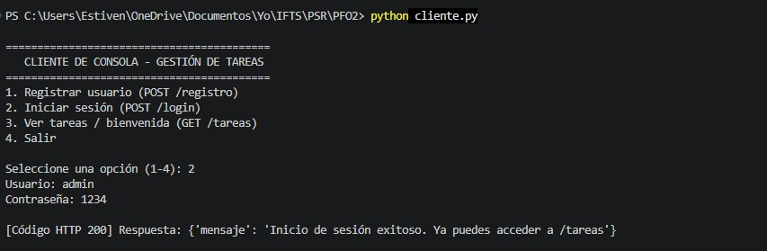
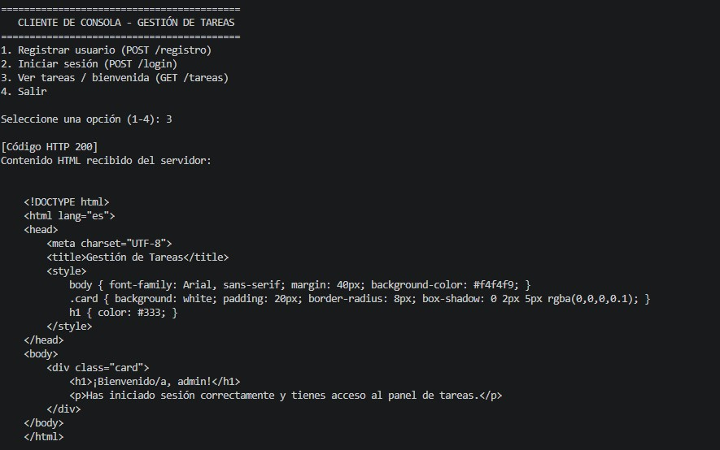

# PFO 2: Sistema de Gestión de Tareas con API y Base de Datos

Trabajo Práctico para la materia **Programación sobre Redes**. Consiste en la implementación de una API REST utilizando **Flask**, persistencia de datos mediante **SQLite**, autenticación segura con **hasheo de contraseñas** y un **cliente en consola** que interactúa con el servidor.

---

## Estructura del Proyecto

* `servidor.py`: Servidor backend con la API Flask y conexión a la base de datos SQLite.
* `cliente.py`: Cliente interactivo en consola que consume los endpoints de la API.
* `usuarios.db`: Base de datos SQLite (se genera automáticamente al iniciar el servidor).
* `capturas/`: Evidencias de las pruebas realizadas sobre los endpoints y la base de datos.

---

## Requisitos e Instalación

1. Clonar este repositorio o descargar los archivos en un directorio local.
2. Asegurarse de tener **Python 3.x** instalado.
3. Instalar las dependencias necesarias (`flask` para el servidor y `requests` para el cliente en consola) ejecutando en la terminal:

```bash
pip install flask requests
```

---

## Instrucciones de Ejecución y Prueba

### 1. Iniciar el Servidor (API Flask)
Ejecutar el archivo principal del servidor en una terminal:

```bash
python servidor.py
```

*El servidor abrirá un socket TCP local escuchando peticiones HTTP en `http://127.0.0.1:5000` e inicializará automáticamente la base de datos `usuarios.db`.*

### 2. Interactuar con la API

#### Opción A: Mediante el Cliente en Consola (`cliente.py`)
Sin cerrar la terminal del servidor, abrir una **segunda terminal** en la carpeta del proyecto y ejecutar:

```bash
python cliente.py
```

Se desplegará un menú interactivo en consola que permite:
1. Registrar un usuario nuevo (`POST /registro`).
2. Iniciar sesión manteniendo la cookie activa (`POST /login`).
3. Consultar el endpoint protegido y recibir el HTML de bienvenida (`GET /tareas`).

#### Opción B: Mediante Cliente HTTP (Thunder Client / Postman)
Con el servidor en ejecución, realizar las siguientes peticiones:

* **Registro de Usuario (`POST http://127.0.0.1:5000/registro`):**
  Enviar un cuerpo JSON con el formato `{"usuario": "admin", "contraseña": "1234"}`.
* **Inicio de Sesión (`POST http://127.0.0.1:5000/login`):**
  Enviar las mismas credenciales por JSON para validar el hash y establecer la sesión activa.
* **Gestión de Tareas (`GET http://127.0.0.1:5000/tareas`):**
  Solicitar el recurso con la sesión iniciada para recibir el documento HTML de bienvenida.

---

## Capturas de Pantalla de Pruebas Exitosas

### 1. Registro de usuario (`POST /registro`)


### 2. Inicio de sesión (`POST /login`)


### 2. Inicio de sesión desde consola (`POST /login`)


### 3. Persistencia en SQLite con contraseña hasheada (`usuarios.db`)


### 4. Acceso a `/tareas` - Respuesta HTML (`GET /tareas`)


### 4. Acceso a `/tareas` - Respuesta HTML consola (`GET /tareas`)


### 5. Acceso a `/tareas` - Vista Previa Renderizada (`GET /tareas`)
