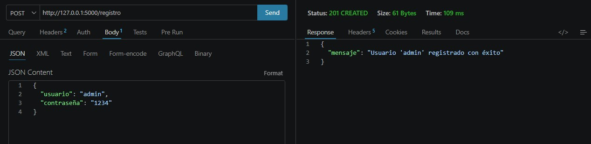
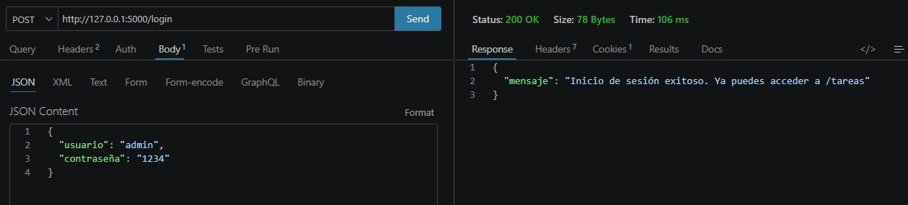
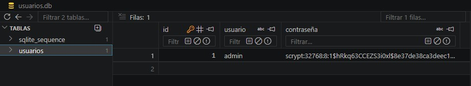
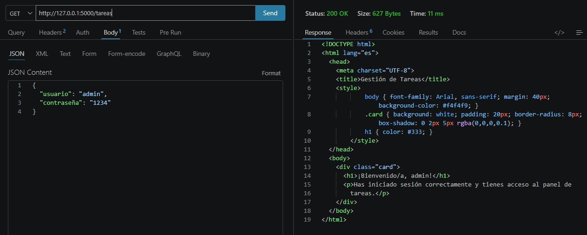
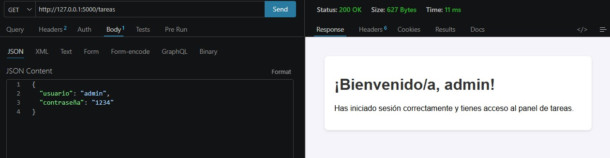

# PFO 2: Sistema de Gestión de Tareas con API y Base de Datos

Trabajo Práctico para la materia **Programación sobre Redes**. Consiste en la implementación de una API REST utilizando **Flask**, persistencia de datos mediante **SQLite** y autenticación segura con **hasheo de contraseñas**.

---

## Requisitos e Instalación

1. Clonar este repositorio o descargar los archivos en un directorio local.
2. Asegurarse de tener **Python 3.x** instalado.
3. Instalar Flask (que incluye `werkzeug` para el hasheo de contraseñas) ejecutando en la terminal:

```bash
pip install flask
```

---

## Instrucciones de Ejecución y Prueba

### 1. Iniciar el Servidor (API Flask)
Ejecutar el archivo principal del servidor en la terminal:

```bash
python servidor.py
```

*El servidor abrirá un socket TCP local escuchando peticiones HTTP en `http://127.0.0.1:5000` e inicializará automáticamente la base de datos `usuarios.db`.*

### 2. Probar los Endpoints (Thunder Client / Postman)
Con el servidor en ejecución, realizar las siguientes peticiones desde un cliente HTTP:

* **Registro de Usuario (`POST /registro`):**
  Enviar un cuerpo JSON con el formato `{"usuario": "admin", "contraseña": "1234"}`.
* **Inicio de Sesión (`POST /login`):**
  Enviar las mismas credenciales por JSON para validar el hash y establecer la sesión activa.
* **Gestión de Tareas (`GET /tareas`):**
  Solicitar el recurso con la sesión iniciada para recibir el documento HTML de bienvenida.

---

## Capturas de Pantalla de Pruebas Exitosas

### 1. Registro de usuario (`POST /registro`)


### 2. Inicio de sesión (`POST /login`)


### 3. Persistencia en SQLite con contraseña hasheada (`usuarios.db`)


### 4. Acceso a `/tareas` - Respuesta HTML (`GET /tareas`)


### 5. Acceso a `/tareas` - Vista Previa Renderizada (`GET /tareas`)
